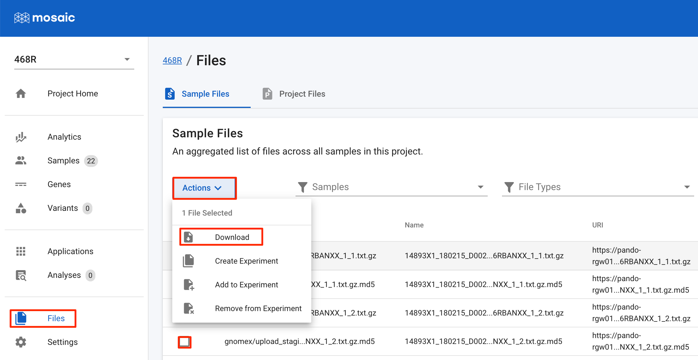

[CDDRC Docs](../README.md) - Data Access

# Data Access

## How to download data files for a project

Navigate to the project.  Click on the 'Files' link in the left pane.  Select a file checkbox from the file list.  Select the 'Actions' drop-down above the file list and select 'Download'.

